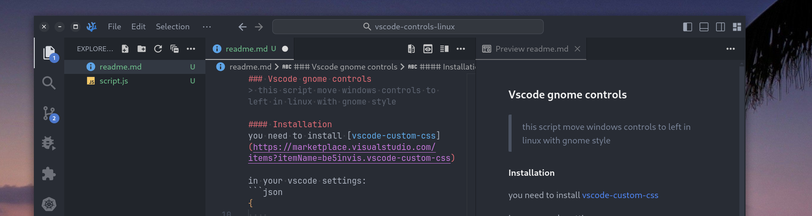

### Vscode gnome controls


> this script move windows controls to left in linux with gnome style

#### Installation
you need to install [vscode-custom-css](https://marketplace.visualstudio.com/items?itemName=be5invis.vscode-custom-css)

in your vscode settings:
```json
{
    ...
    // change were this script is located
    "vscode_custom_css.imports": ["https://raw.githubusercontent.com/remigermain/vscode-controls-linux/refs/heads/main/script.js"],

    // needed to change to custom style
    "window.titleBarStyle": "custom",

    // important to disable native controls 
    "window.experimentalControlOverlay": false
}
```

next restart your vscode in sudo mode or follow the [extentions](https://marketplace.visualstudio.com/items?itemName=be5invis.vscode-custom-css) instructions.

```sh
# run vscode in sudo
sudo chown -R $(whoami) "$(which codium 2>/dev/null || which code)"
sudo chown -R $(whoami) /usr/share/$(which codium &>/dev/null && echo "codium" || echo "code")

# in vscode open command palette
Reload custom CSS and JS
```
